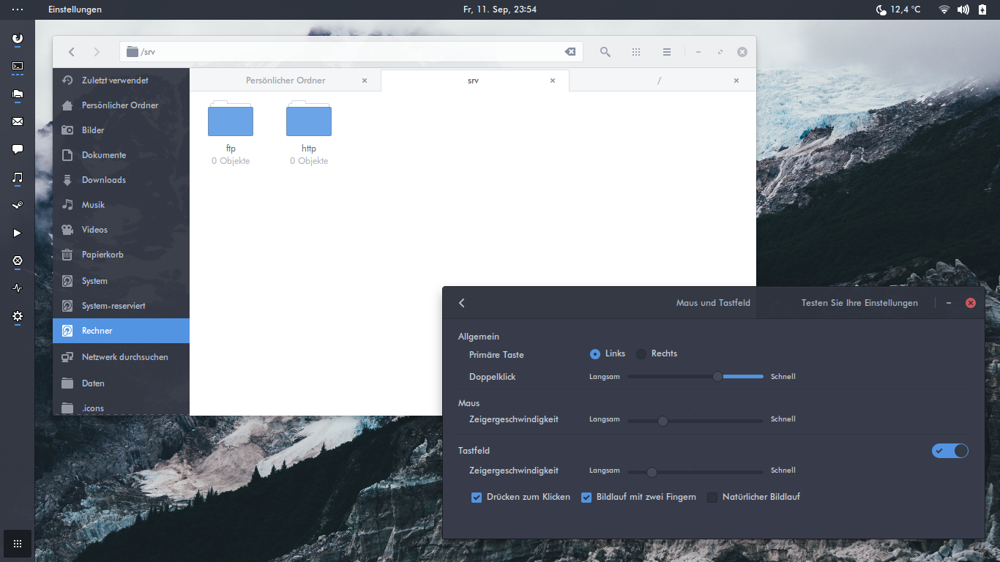
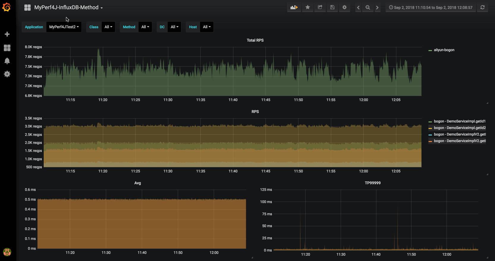

# Github management
> [[返回](../../../../README.md)]

---

## 不想工作

* [[AIinterview](https://github.com/PPshrimpGo/AIinterview)]
  > 算法工程师面试题整理

* [[Back-End-Developer-Interview-Questions](https://github.com/monklof/Back-End-Developer-Interview-Questions)]
  > 后端开发面试题。

* [[architect-awesome](https://github.com/xingshaocheng/architect-awesome)]
  > 后端架构师技术图谱

* [[JCSprout](https://github.com/crossoverJie/JCSprout)]
  > 处于萌芽阶段的 Java 核心知识库。

* [[awesome-java-leetcode](https://github.com/Blankj/awesome-java-leetcode)]
  > 用Java解决方案的LeetCode算法（更新）。

* [[SSM](https://github.com/crossoverJie/SSM)]
  > 从0开始分布式微服务构建SSM。

* [[Java-concurrency](https://github.com/CL0610/Java-concurrency)]
  > Java并发知识点总结

* [[CS-Notes](https://github.com/CyC2018/CS-Notes)]
  > 技术面试必备基础知识、Leetcode 题解、后端面试、Java 面试、春招、秋招、操作系统、计算机网络、系统设计

* [[Algorithm_Interview_Notes-Chinese](https://github.com/imhuay/Algorithm_Interview_Notes-Chinese)]
  > 2018/2019/校招/春招/秋招/算法/机器学习(Machine Learning)/深度学习(Deep Learning)/自然语言处理(NLP)/C/C++/Python/面试笔记

---

## 没事别学习

* [[LSTM-Neural-Network-for-Time-Series-Prediction](https://github.com/jaungiers/LSTM-Neural-Network-for-Time-Series-Prediction)]
  > LSTM使用Keras Python包构建，以预测时间序列步骤和序列。包括sin wave和股市数据。

* [[docker_practice](https://github.com/yeasy/docker_practice)]
  > Docker — 从入门到实践

* [[Tensorflow-Cookbook](https://github.com/taki0112/Tensorflow-Cookbook)]
  > 简单的Tensorflow Cookbook易于使用教程

* [[deep-learning-drizzle](https://github.com/kmario23/deep-learning-drizzle)]
  > 通过学习这些激动人心的讲座，深入学习深度学习，强化学习，机器学习，计算机视觉和NLP！

* [[OI-wiki](https://github.com/24OI/OI-wiki)]
  > OI Wiki 致力于成为一个免费开放且持续更新的知识整合站点，大家可以在这里获取关于 编程竞赛 (competitive programming) 有趣又实用的知识，我们为大家准备了竞赛中的基础知识、常见题型、解题思路以及常用工具等内容，帮助大家更快速深入地学习编程竞赛。

* [[SpringBoot-Learning](https://github.com/dyc87112/SpringBoot-Learning)]
  > Spring Boot基础教程，Spring Boot 2.x版本连载中！！

* [[models](https://github.com/tensorflow/models)]
  > 使用TensorFlow构建的模型和示例

* [[tensorflow-zh](https://github.com/jikexueyuanwiki/tensorflow-zh)]
  > 谷歌全新开源人工智能系统TensorFlow官方文档中文版

* [[os-tutorial](https://github.com/cfenollosa/os-tutorial)]
  > 如何从头开始创建操作系统！

* [[finetune-transformer-lm](https://github.com/openai/finetune-transformer-lm)]
  > Code and model for the paper "Improving Language Understanding by Generative Pre-Training"

* [[SQLNet](https://github.com/xiaojunxu/SQLNet)]
  > 用于从自然语言生成结构化查询的神经网络。

* [[RecommenderSystem-Paper](https://github.com/daicoolb/RecommenderSystem-Paper)]
  > 推荐系统中使用的论文，工具和框架。

* [[bert](https://github.com/google-research/bert)]
  > TensorFlow代码和预先训练的BERT模型

* [[react-developer-roadmap](https://github.com/adam-golab/react-developer-roadmap)]
  > 成为2019年React开发人员的路线图

* [[kgraph](https://github.com/aaalgo/kgraph)]
  > A library for k-nearest neighbor search

* [[Tensorflow-Tutorial](https://github.com/MorvanZhou/Tensorflow-Tutorial)]
  > 在这些教程中，我们将构建我们的第一个神经网络，并尝试构建一些近年来开发的高级神经网络架构。

* [[awesome-etl](https://github.com/pawl/awesome-etl)]
  > 精选的ETL（提取，转换，加载）框架，库和软件的精选列表。

---

## 无聊的项目

* [[SPADE](https://github.com/NVlabs/SPADE)] 
  > 英伟达（NVIDIA）新开源的绘图工具。利用生成对抗网络，根据几根简单的线条就能生成栩栩如生的图像。
  
  > 

* [[awesome-scalability](https://github.com/binhnguyennus/awesome-scalability)]
  > 一个系统的阅读列表，描述了可扩展、高可用、高性能的大型系统背后的东西。每部分都是基于真实案例，讲述了如何搭建一个可扩展、高可用、高性能的大型系统，案例都是来自于经过数百万甚至数十亿用户实战检验的系统。对于所有工程师而言都是一个很好的学习资料，开卷有益。

* [[docker-cheat-sheet](https://github.com/wsargent/docker-cheat-sheet)]
  > 关于Docker详细的备忘单。

* [[netdata](https://github.com/netdata/netdata)]
  > Netdata是系统和应用程序的分布式，实时，性能和健康监控。它是您在所有系统和容器上安装的高度优化的监视代理程序。

* [[ChromeAppHeroes](https://github.com/zhaoolee/ChromeAppHeroes)]
  > 谷粒-Chrome插件英雄榜, 为优秀的Chrome插件写一本中文说明书, 让Chrome插件英雄们造福人类~

* [[howto-make-more-money](https://github.com/easychen/howto-make-more-money)]
  > 程序员如何优雅的挣零花钱？

* [[awesome-python-login-model](https://github.com/CriseLYJ/awesome-python-login-model)]
  > python模拟登陆一些大型网站，还有一些简单的爬虫。

* [[nerd-fonts](https://github.com/ryanoasis/nerd-fonts)]
  > 标志性的字体聚合器，集合和修补程序。 40多个修补字体，超过3,600个字形/图标，包括流行的集合，如Font Awesome和Hack等字体

* [[html5-boilerplate](https://github.com/h5bp/html5-boilerplate)]
  > HTML5 Boilerplate是一个专业的前端模板，用于构建快速，健壮且适应性强的Web应用程序或站点。 该项目是多年迭代开发和社区知识的产物。它没有强加特定的开发理念或框架，因此您可以自由地以您想要的方式构建代码。

* [[python-spider](https://github.com/Jack-Cherish/python-spider)]
  > Python3网络爬虫实战：VIP视频破解助手；GEETEST验证码破解；小说、动漫下载；手机APP爬取；财务报表入库；火车票抢票；抖音APP视频下载；百万英雄辅助；网易云音乐下载；B站视频和弹幕下载

* [[django-blog-tutorial](https://github.com/zmrenwu/django-blog-tutorial)]
  > 免费、中文、零基础，完整的项目，基于最新版 Django 1.10 和 Python 3.5。带你从零开始一步步开发属于自己的博客网站，帮助你以最快的速度掌握 Django 开发的技巧。

* [[arc-theme](https://github.com/horst3180/arc-theme)]
  > Arc是一个平面主题，具有透明元素，适用于GTK 3，GTK 2和GNOME Shell，支持基于GTK 3和GTK 2的桌面环境，如GNOME，Unity，Budgie，Pantheon，Xfce，MATE等。(Ubuntu)
  
  > 

* [[vjtools]([test](https://github.com/vipshop/vjtools))]
  > vip.com的java编码标准，库和工具

* [[awesome-mac](https://github.com/jaywcjlove/awesome-mac/blob/master/README-zh.md)]
  > 收集各种类别非常好用的 Mac 应用程序、软件以及工具。

* [[halo](https://github.com/halo-dev/halo)]
  > Halo 可能是最好的 Java 博客系统

* [[deepin-wine-ubuntu](https://github.com/wszqkzqk/deepin-wine-ubuntu)]
  > Deepin-wine 环境的 Ubuntu 移植版(可以安装QQ，TIM，百度云)

* [[SSD-Tensorflow](https://github.com/balancap/SSD-Tensorflow)]
  > TensorFlow中的单发多盒检测器

* [[odo](https://github.com/blaze/odo)]
  > Odo migrates data between different containers

* [[blaze](https://github.com/blaze/blaze)]
  > Blaze将修改后的NumPy和Pandas类语法的子集转换为数据库和其他计算系统。 Blaze允许Python用户使用熟悉的界面来查询其他数据存储系统中的数据。

---

## 没有什么用的工具

* [[scrapydweb](https://github.com/my8100/scrapydweb/blob/master/README_CN.md)]
  > ScrapydWeb：用于 Scrapyd 集群管理的web应用，支持 Scrapy 日志分析和可视化。

* [[drone](https://github.com/drone/drone)]
  > Drone是一个面向繁忙开发团队的自助式持续交付平台。

* [[codelf](https://github.com/unbug/codelf)]
  > 搜索来自Github，Bitbucket，Google Code，Codeplex，Sourceforge，Fedora Project，GitLab的项目，以查找真实世界的用法变量名称(现在不能用)。

* [[hutool](https://github.com/looly/hutool)]
  > Hutool是一个Java工具包，也只是一个工具包，它帮助我们简化每一行代码，减少每一个方法，让Java语言也可以“甜甜的”。Hutool最初是我项目中“util”包的一个整理，后来慢慢积累并加入更多非业务相关功能，并广泛学习其它开源项目精髓，经过自己整理修改，最终形成丰富的开源工具集。

* [[MyPerf4J](https://github.com/LinShunKang/MyPerf4J)]
  > 一个针对高并发、低延迟应用设计的高性能 Java 性能监控和统计工具。
  
  > 

* [[moco](https://github.com/dreamhead/moco)]
  > Moco是一个简单的安装存根框架。

* [[greys-anatomy](https://github.com/oldmanpushcart/greys-anatomy)]
  > 线上系统为何经常出错？数据库为何屡遭黑手？业务调用为何频频失败？连环异常堆栈案，究竟是哪次调用所为？ 数百台服务器意外雪崩背后又隐藏着什么？是软件的扭曲还是硬件的沦丧？ 走进科学带你了解Greys, Java线上问题诊断工具。

* [[filebrowser](https://github.com/filebrowser/filebrowser)]
  > Web文件浏览器，可用作中间件或独立应用程序。

* [[FeelUOwn](https://github.com/cosven/FeelUOwn)]
  > FeelUOwn 是一个符合 Unix 哲学的跨平台的音乐播放器，主要面向 Linux/macOS 用户。
  
  > 

* [[hue](https://github.com/cloudera/hue)]
  > Hue是一个开源SQL Workbench，用于在云/本地数据仓库中浏览，查询和可视化数据：gethue.com

* [[lazygit](https://github.com/jesseduffield/lazygit)]
  > git命令的简单终端UI

* [[dejavu](https://github.com/worldveil/dejavu)]
  > Dejavu可以通过聆听音频并对其进行指纹识别来记忆音频。然后，通过播放歌曲和录制麦克风输入，Dejavu尝试将音频与数据库中保存的指纹进行匹配，然后返回正在播放的歌曲。

* [[baidu-netdisk-downloaderx](https://github.com/b3log/baidu-netdisk-downloaderx)]
  > 百度网盘不限速下载器 BND，支持 Windows、Mac 和 Linux。

* [[Boostnote](https://github.com/BoostIO/Boostnote)]
  > 适用于Mac，Windows和Linux的开发人员的markdown编辑器

---

## 看不懂的操作

* [[BuildOpenJDK9-on-Mojave](https://github.com/laskfla/BuildOpenJDK9-on-Mojave)]
  > 从源代码在Mac Mojave（10.14.1）上构建OpenJDK9(在10.13上面也可以)。

* [[document-style-guide](https://github.com/ruanyf/document-style-guide)]
  > 中文技术文档的写作规范

* [[API-Security-Checklist](https://github.com/shieldfy/API-Security-Checklist/blob/master/README-zh.md)]
  > 开发安全的 API 所需要核对的清单

* [[disconf](https://github.com/knightliao/disconf)]
  > Distributed Configuration Management Platform(分布式配置管理平台)
  > 专注于各种「分布式系统配置管理」的「通用组件」和「通用平台」, 提供统一的「配置管理服务」

---

## books

* [[es6tutorial](https://github.com/ruanyf/es6tutorial)]
  > 《ECMAScript 6 入门》是一本开源的 JavaScript 语言教程，全面介绍 ECMAScript 6 新引入的语法特性。
  
  >  

* [[deeplearning_ai_books](https://github.com/fengdu78/deeplearning_ai_books)]
  > deeplearning.ai（吴恩达老师的深度学习课程笔记及资源）

* [[translations](https://github.com/oldratlee/translations)]
  > 一些不错英文资料的中文翻译。

* [[the-craft-of-selfteaching](https://github.com/selfteaching/the-craft-of-selfteaching)]
  > 没有自学能力的人没有未来。

* [[cachecloud](https://github.com/sohutv/cachecloud)]
  > CacheCloud团队于2017年3月出版实体书《Redis开发与运维》

* [[d2l-zh](https://github.com/d2l-ai/d2l-zh)]
  > 《动手学深度学习》，英文版即伯克利深度学习（STAT 157，2019春）教材。面向中文读者、能运行、可讨论。

* [[redis](https://github.com/antirez/redis)]
  > 本自述文件只是一个快速入门的快速文档。您可以在redis.io上找到更详细的文档。

---

## papers

* [[Deep-Learning-for-Recommendation-Systems](https://github.com/robi56/Deep-Learning-for-Recommendation-Systems)]
  > 此存储库包含基于深度学习的文章，推荐系统的纸张和存储库

* [[Coursera-ML-AndrewNg-Notes](https://github.com/fengdu78/Coursera-ML-AndrewNg-Notes)]
  > 吴恩达老师的机器学习课程个人笔记

* [[GNNPapers](https://github.com/thunlp/GNNPapers)]
  > 必读的GNN论文。

* [[time_lstm](https://github.com/ZJULearning/time_lstm)]
  > This project is the implementation of the paper "What to Do Next: Modeling User Behaviors by Time-LSTM".

---